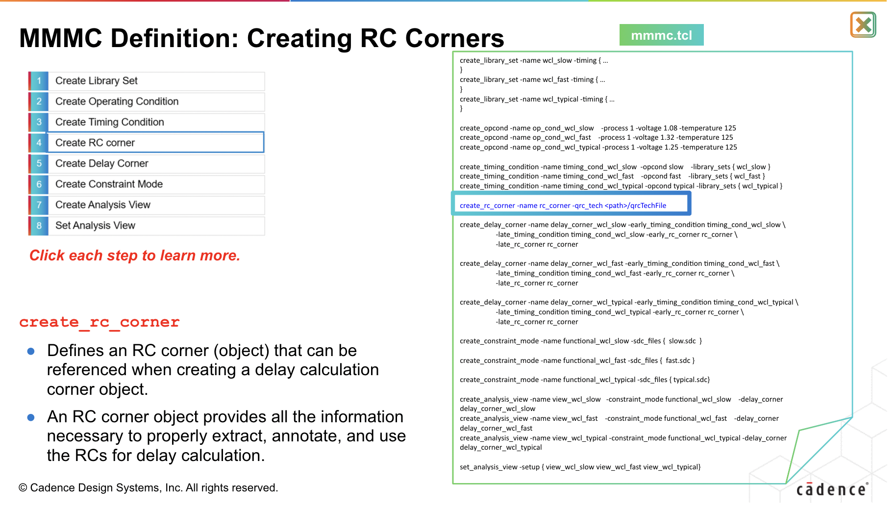
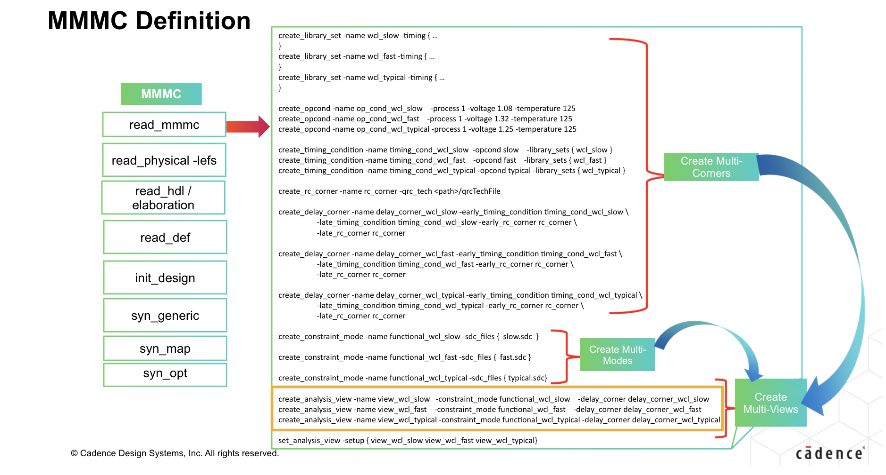

<span style="color:#ad4ce5;">
<pre style="background-color:#222;">
░░░░░░░░░░░░░░░░░░░░░░░░░░░░░░░░░░░░░░░░░░░░░░░░░░░░░░░░░░░░░░░░░░░░░░░░░░░░░░░░░░░░░░░░░░░
░░░░░░░░░░░░░░░░░░░░░░░░░░░░░░░░░░░░░░░░░░░░░░░░░░░░░░░░░░░░░░░░░░░░░░░░░░░░░░░░░░░░░░░░░░░
░░░░░░░░░░░░░<span style="color:#fff">██╗</span>░░░░░░░<span style="color:#fff">██╗</span>░<span style="color:#fff">█████╗</span>░<span style="color:#fff">██╗</span>░░░░░<span style="color:#fff">███████╗</span>░░░<span style="color:#fff">██████╗</span>░<span style="color:#fff">██╗</span>░░░<span style="color:#fff">██╗███╗</span>░░<span style="color:#fff">██╗</span>░░░░░░░░░░░░
░░░░░░░░░░░░░<span style="color:#fff">██║</span>░░<span style="color:#fff">██╗</span>░░<span style="color:#fff">██║██╔══██╗██║</span>░░░░░<span style="color:#fff">██╔════╝</span>░░░<span style="color:#fff">██╔══██╗██║</span>░░░<span style="color:#fff">██║████╗</span>░<span style="color:#fff">██║</span>░░░░░░░░░░░░
░░░░░░░░░░░░░<span style="color:#fff">╚██╗████╗██╔╝██║</span>░░<span style="color:#fff">██║██║</span>░░░░░<span style="color:#fff">█████╗</span>░░░░░<span style="color:#fff">██████╔╝██║</span>░░░<span style="color:#fff">██║██╔██╗██║</span>░░░░░░░░░░░░
░░░░░░░░░░░░░░<span style="color:#fff">████╔═████║</span>░<span style="color:#fff">██║</span>░░<span style="color:#fff">██║██║</span>░░░░░<span style="color:#fff">██╔══╝</span>░░░░░<span style="color:#fff">██╔══██╗██║</span>░░░<span style="color:#fff">██║██║╚████║</span>░░░░░░░░░░░░
░░░░░░░░░░░░░░<span style="color:#fff">╚██╔╝</span>░<span style="color:#fff">╚██╔╝</span>░<span style="color:#fff">╚█████╔╝███████╗██║</span>░░░░░<span style="color:#fff">██╗██║</span>░░<span style="color:#fff">██║╚██████╔╝██║</span>░<span style="color:#fff">╚███║</span>░░░░░░░░░░░░
░░░░░░░░░░░░░░░<span style="color:#fff">╚═╝</span>░░░<span style="color:#fff">╚═╝</span>░░░<span style="color:#fff">╚════╝</span>░<span style="color:#fff">╚══════╝╚═╝</span>░░░░░<span style="color:#fff">╚═╝╚═╝</span>░░<span style="color:#fff">╚═╝</span>░<span style="color:#fff">╚═════╝</span>░<span style="color:#fff">╚═╝</span>░░<span style="color:#fff">╚══╝</span>░░░░░░░░░░░░
░░░░░░░░░░░░░░░░░░░░░░░░░░░░░░░░░░░░░░░░░░░░░░░░░░░░░░░░░░░░░░░░░░░░░░░░░░░░░░░░░░░░░░░░░░░
</pre>
</span>

# WOLF: A tool for digital flow automation and management.

## 1. Introduction
```bash
TODO
```

## 2. Installation
```bash
TODO
```

## 3. Usage
```bash
TODO
```

#### Commands

- `run`: Run a flow.
- `env`: Manipulates, lists and creates wolf environments, which can be used later for flow recreation.

### Wolf.run

Options:
```bash
Main arguments taken wolf.run:
        -h, --help              Invokes this dialog.

Flow behavior arguments:
        -c, --clean             If set to true, the flow will be run from scratch, ignoring any previous runs, in a new folder.
                                    DEFAULT: false
        -y, --yes               If this flag is present, the script will skip user confirmation at its end, and proceed running the flow.
                                    DEFAULT: false
        -t, --runtag            Manually sets the runtag to a specific value, instead of automatically setting it according to previous runs.
                                    DEFAULT: Obtained automatically by script.
Project-specific arguments:
        -p, --process           Specification of process to be used while running the flow. Must be one of "TSCM65", "GF22"
                                    DEFAULT: TSCM65
        -d, --design            Specification of the design to be synthesized. Must be one of "tdsp_core"
                                    DEFAULT: tdsp_core
        -f, --conf              Specify the full path of the template yaml file used to generate the final setup final that will be passed to flowtool.
                                    DEFAULT:

```


### Wolf.env

#### Create environment 

```bash
foo@bar:~$ wolf env create <NAME>

 ######################################################################################################
 Wolf environments: 
 -------------------------------------------------- 
 test [/tmp/wolf/.envs/test]
 ######################################################################################################
```

#### List environments

```bash
foo@bar:~$ wolf env list

 ######################################################################################################
 Wolf environments: 
 -------------------------------------------------- 
 test [/tmp/wolf/.envs/test]
 ######################################################################################################
```


```
wolf update bucket
```

```
wolf update
```

## Example for AI in pixel
First create an environment
```bash
foo@bar:~$ wolf create -n pixelAI
```

Now activate the environment and setup some variables
```bash
foo@bar:~$ wolf activate pixelAI
|wolf:pixelAI| foo@bar:~$ DESIGN_NAME="pixelArray_full_readout"
```

Now update the bucket of source files to point to the general source script used for all the designs in the FLORA project (point to `/asic/projects/FNAL/xray_imaging/manuelbv/src/inputs/env/FLORA_env.csh`):
```bash
|wolf:pixelAI| foo@bar:~$ wolf update --bucket


    ┌──────────────────────────────────────────────Please choose a file────────────────────────────────────────────────┐
    │ Directories                                             Files                                                    │  
    │ ┌──────────────────────────────────────────────────────┐┌──────────────────────────────────────────────────────┐ │  
    │ │.                                                     ││FLORA_env.csh                                         │ │  
    │ │..                                                    ││FLORA_src.yaml                                        │ │  
    │ │                                                      ││                                                      │ │  
    │ │                                                      ││                                                      │ │  
    │ └───────────────────────────────────────────────50%────┘└───────────────────────────────────────────────12%────┘ │  
    │ ┌──────────────────────────────────────────────────────────────────────────────────────────────────────────────┐ │  
    │ │/asic/projects/FNAL/xray_imaging/manuelbv/src/inputs/env/FLORA_env.csh                                        │ │  
    │ └──────────────────────────────────────────────────────────────────────────────────────────────────────────────┘ │  
    ├──────────────────────────────────────────────────────────────────────────────────────────────────────────────────┤  
    │                                       <  OK  >                    <Cancel>                                       │  
    └──────────────────────────────────────────────────────────────────────────────────────────────────────────────────┘  
```

Now update the wolf environment to save the changes. And reload the environment.

```bash
|wolf:pixelAI| foo@bar:~$ wolf update
|wolf:pixelAI| foo@bar:~$ wolf env reload
```

## Ip-manager
What is this used for?
```
TODO
```

#### Install a library/process
```
TODO
```
Define corners, opconds, voltages,...

- Device map
- Objectmap
- Layermap path
- Techfile path
- qrcTechfile path
- Voltages/Temp ranges


#### PDK/Digital libs
```
TODO
```

#### Query information about the library
LEFS
```
TODO
```
GDS
```
TODO
```
SPICE
```
TODO
```
VERILOG
```
TODO
```

## Wizard
What can you setup using the wizard?

#### RTL/inputs
Setup and point to the code required for the flow

#### Technology/Process
Pick process to be used among installed ips 

- TSMC 28nm
- TSMC 65nm
- GF 22nm
- etc.

#### MMMC config
- Library sets
- Op conds
- Timing conditions
- RC corners
- Delay corners
- Constraint modes
- Analysis views







#### Cells
 - Don't use. A window in the command line line below, where the user can pick which cells not to use.
```bash

    ┌────────────────────────────────────────────── Choose cells to use  ────────────────────────────────────────────────┐
    │                                                                                                                    │
    │────────────────────────────────────────────────────────────────────────────────────────────────────────────────────│
    │ [x] CKND1                                                                                                          │  
    │ [x] CKND2                                                                                                          │ 
    │ [x] CKND4                                                                                                          │ 
    │ [ ] CFDN1                                                                                                          │ 
    │ [ ] CFDN2                                                                                                          │
    │ [ ] ...                                                                                                            │
```


#### Calibre DRC/LVS
- Point to custom LVS rulefiles to be added for nmLVS
  - setup.yaml: `user_lvs_rulefiles` 
- Point to custom DRC rulefiles to be added for DRC
  - setup.yaml: `user_drc_rulefiles` 

